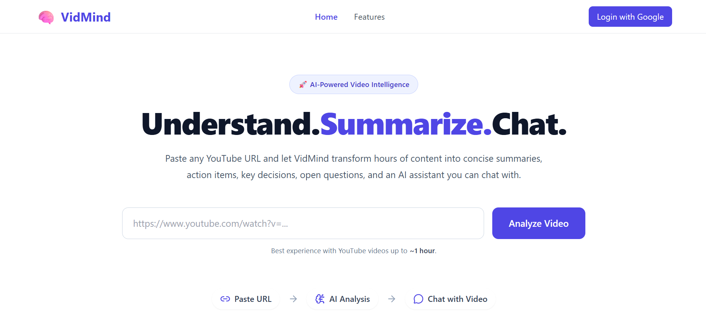
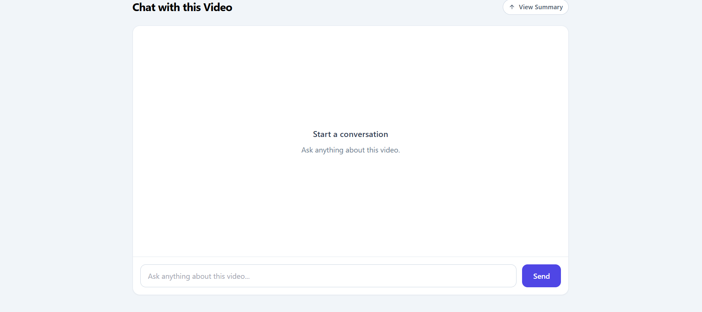
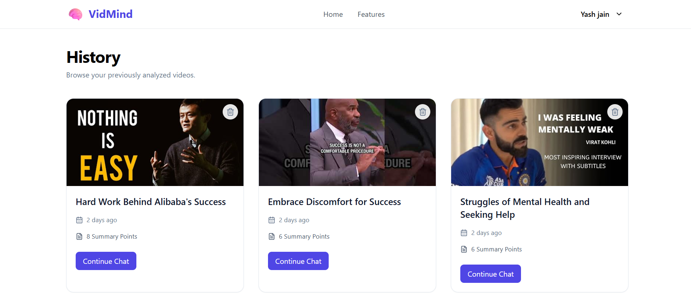

# 🎥 VidMind AI

> An AI-powered video assistant that transforms YouTube videos into searchable knowledge bases using Whisper, Retrieval-Augmented Generation (RAG), and Mistral AI.

<p align="center">
  
  
  
  
  
  
</p>

---

## 🚀 Overview

VidMind AI allows users to chat with YouTube videos as if they were documents.

Instead of manually watching long videos to find specific information, users simply provide a YouTube URL. VidMind downloads the audio, generates transcripts using Whisper, creates semantic embeddings, stores them in a vector database, and answers questions using Retrieval-Augmented Generation (RAG).

The project follows a microservice architecture consisting of:

- React Frontend
- Node.js Backend
- FastAPI AI Service

---

# ✨ Features

- 🎥 Process YouTube videos
- 📄 Automatic transcript generation
- 🧠 Semantic search using embeddings
- 💬 Context-aware AI chat
- 📚 Retrieval-Augmented Generation (RAG)
- 🔐 Google OAuth Authentication
- 🗂 Persistent chat history
- ⚡ Fast vector search with Qdrant
- 🌐 Fully deployed cloud application

---

# 🏗 System Architecture

```text
                  ┌──────────────────────────┐
                  │       React Client       │
                  │        (Vercel)          │
                  └────────────┬─────────────┘
                               │
                               ▼
                  ┌──────────────────────────┐
                  │     Express Backend      │
                  │        (Render)          │
                  └────────────┬─────────────┘
                               │
               ┌───────────────┴────────────────┐
               │                                │
               ▼                                ▼
       MongoDB Atlas                    FastAPI AI Service
                                           (Railway)
                                               │
          ┌────────────────────────────────────┼──────────────────────────────────┐
          ▼                                    ▼                                  ▼
    Whisper Transcription              Qdrant Vector DB                   Mistral AI
```

---

# ⚙️ Tech Stack

## Frontend

- React
- React Router
- Tailwind CSS
- Axios

## Backend

- Node.js
- Express.js
- Passport.js
- Google OAuth
- MongoDB Atlas
- Mongoose

## AI Service

- FastAPI
- LangChain
- Mistral AI
- Whisper
- Sentence Transformers
- Qdrant Vector Database
- yt-dlp
- FFmpeg

---

# 🧠 AI Pipeline

```text
YouTube URL
      │
      ▼
Download Audio
      │
      ▼
Audio Chunking
      │
      ▼
Whisper Transcription
      │
      ▼
Transcript Chunking
      │
      ▼
Sentence Embeddings
      │
      ▼
Qdrant Vector Database
      │
      ▼
Retriever
      │
      ▼
Mistral AI
      │
      ▼
Context-aware Response
```

---

# 📷 Screenshots

## 🏠 Landing Page



---

## 💬 AI Chat



---

## 📜 Chat History



---

# 📦 Project Structure

```text
VidMind-AI
│
├── client              # React Frontend
├── server              # Express Backend
└── python-service      # FastAPI AI Service
    ├── core
    ├── downloads
    ├── storage
    └── utils
```

---

# 🔥 Core Workflow

1. User authenticates using Google OAuth.
2. Paste a YouTube URL.
3. Audio is downloaded using yt-dlp.
4. Audio is chunked.
5. Whisper generates transcripts.
6. Transcript is split into semantic chunks.
7. Sentence Transformers create embeddings.
8. Embeddings are stored in Qdrant.
9. User asks questions.
10. Relevant transcript chunks are retrieved.
11. Mistral AI generates context-aware responses.

---

# 🌍 Deployment

| Service | Platform |
|----------|----------|
| Frontend | Vercel |
| Backend | Render |
| AI Service | Railway |
| Database | MongoDB Atlas |
| Vector Database | Qdrant Cloud |

---

# 📈 Future Improvements

- Multi-language transcription
- Timestamp-aware responses
- Video chapter generation
- Speaker identification
- Streaming AI responses
- Playlist processing
- Voice chat

---

# 👨‍💻 Author

**Yash Jain**

Software Engineering Undergraduate @ Delhi Technological University

- GitHub: https://github.com/yashjain8448
- LinkedIn: https://www.linkedin.com/in/yash-jain-b87527272/

---

## ⭐ If you found this project interesting, consider giving it a star!
